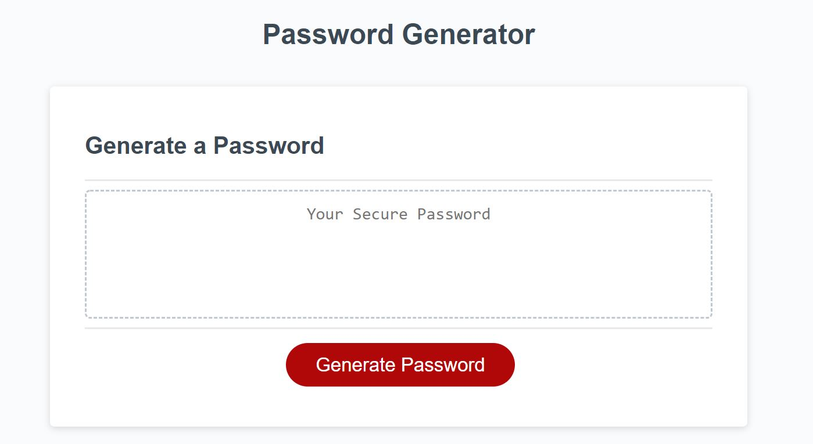

# password-generator

For this project, I modified existing html, css, and javascript code to create a Password Generator. When the user clicks "Generate Password" they are prompted to answer a series of qualifiers for the password specifics.  The created code then stores their input and will use it to generate a random password that fulfills their requests.  I used Git to commit and push my changes and GitHub to house the repository where I then deployed the completed project.  

## Snapshot

## Built With

* [Visual Studio Code](https://code.visualstudio.com/) - to create and modify the code on my local device
* [HTML](https://developer.mozilla.org/en-US/docs/Web/HTML) - to create elements
* [CSS](https://developer.mozilla.org/en-US/docs/Web/CSS) - to style the html elements
* [Javascript](https://www.javascript.com/) - to create actions on the page
* [Git](https://git-scm.com/) - to track changes and push commits
* [GitHub](github.com) - to host the repository and deploy with GitHub pages

## Deployed Link

* [https://kiri-smith.github.io/basic-portfolio/](#)

## Author

* Kiri Smith 

- [https://kiri-smith.github.io/](#)
- [https://github.com/kiri-smith](https://github.com/)
- [https://www.linkedin.com/in/kiri-lynne-smith/](https://www.linkedin.com/)

## License

This project is licensed under the MIT License.

## Acknowledgments

* Jerome Chenette - for imparting tips, tricks, and wisdom of coding with my cohort
* My peers - for answering questions, pushing me to excel and supporting this journey
* Armenuhi Avanesyan - for her support through our tutoring sessions